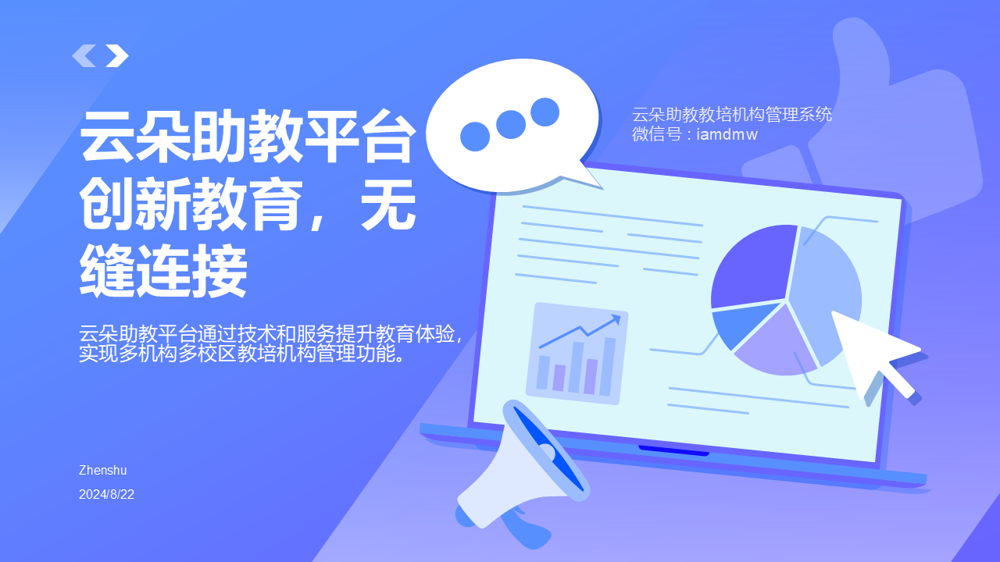
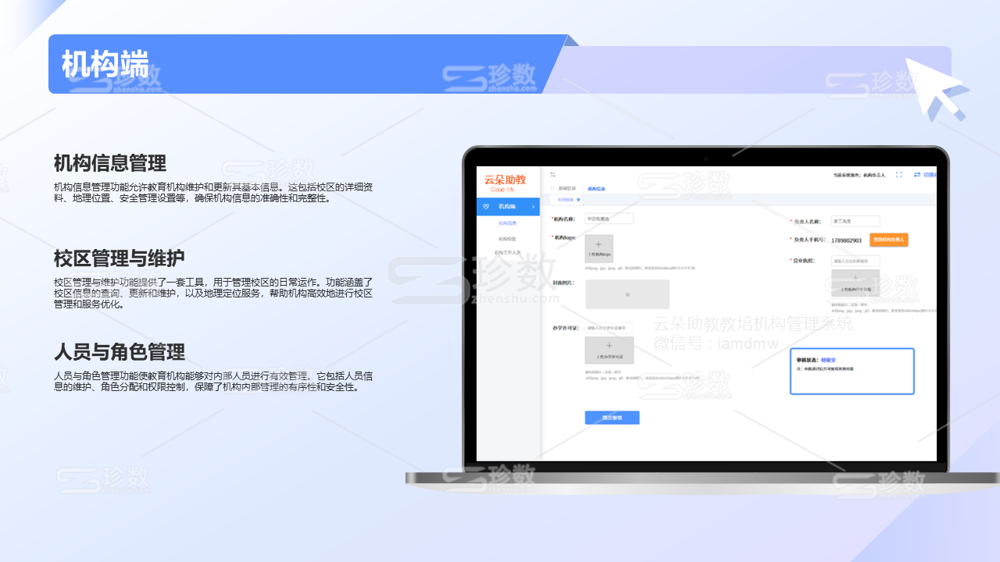
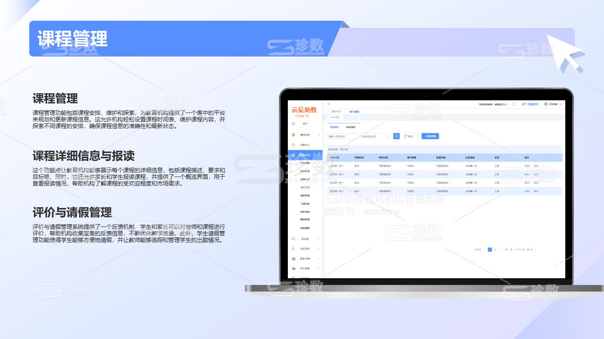
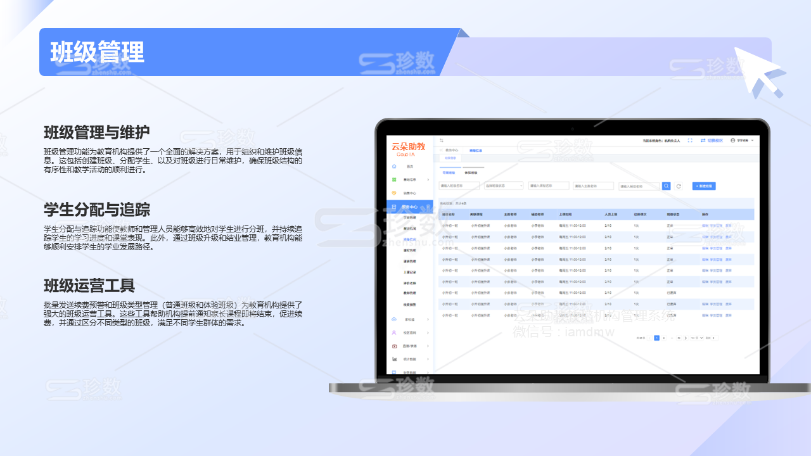
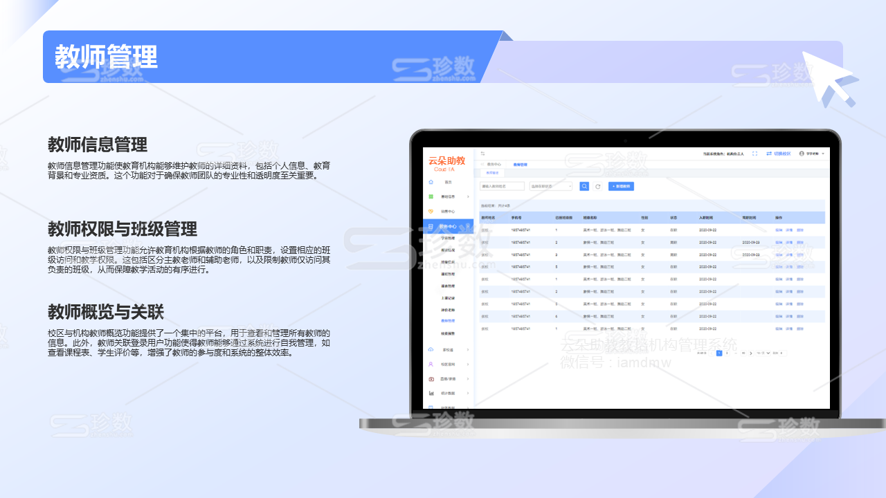
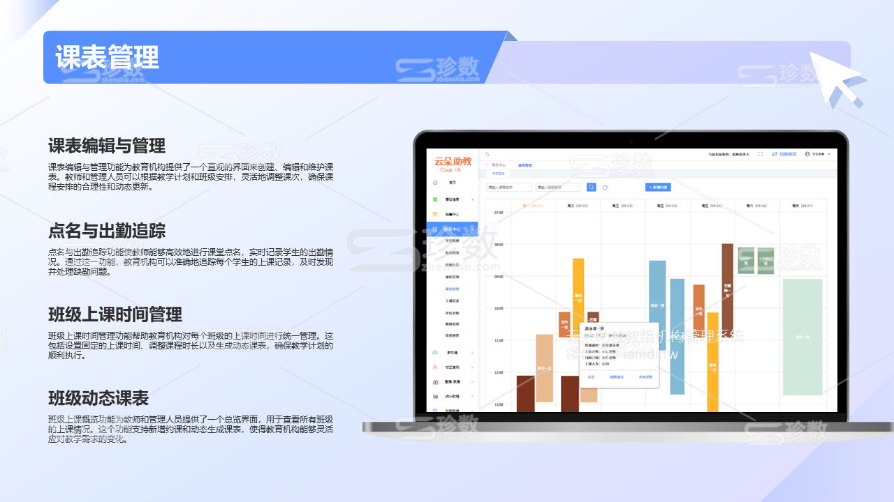
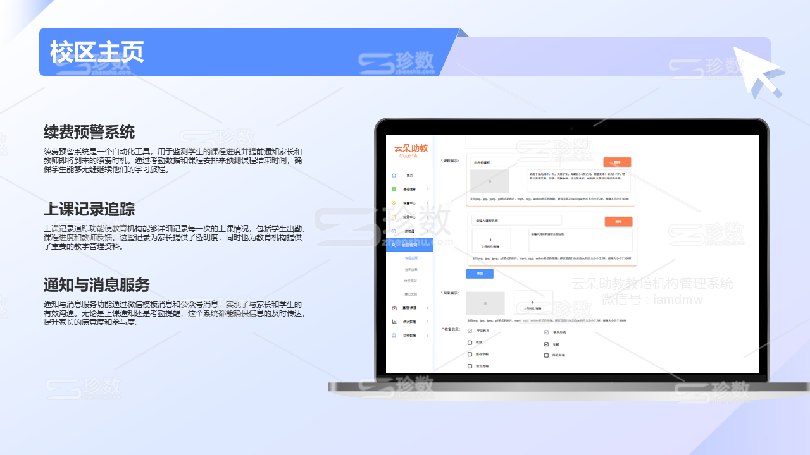
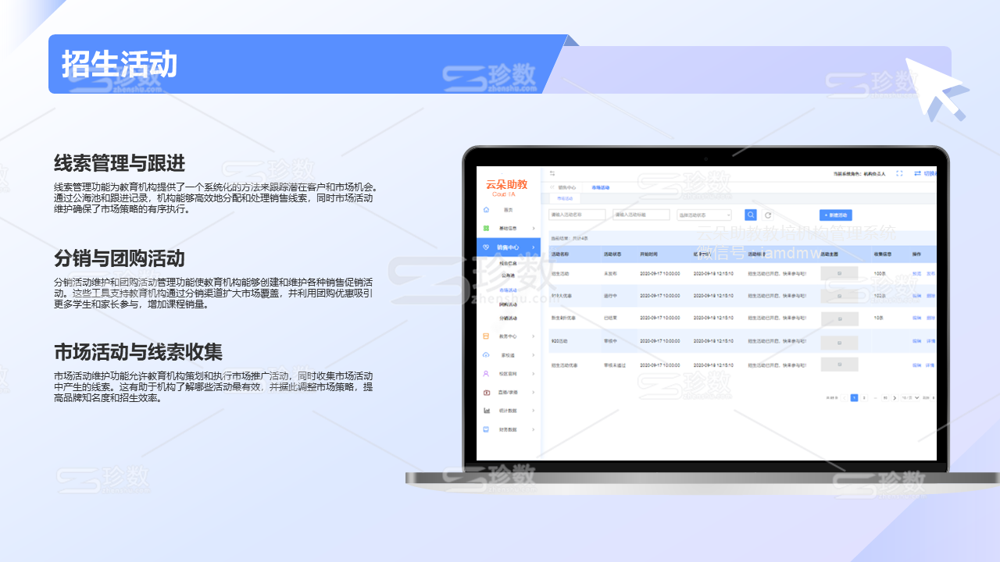
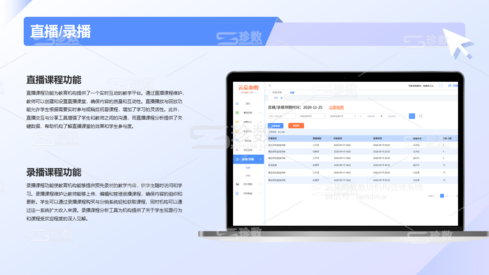
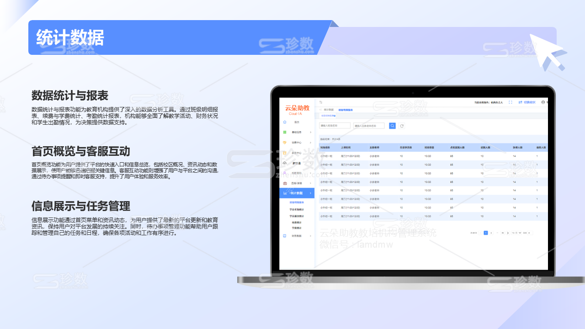

# 臻优学-教培机构管理系统和小程序-一站式解决方案

## 一、智慧教育，触手可及 —— 臻优学，让学习更懂你。

**核心功能介绍：**
臻优学平台，以家长和教育机构为核心，打造了一站式的教育管理解决方案。家长端小程序让家长轻松管理孩子课程，实时掌握学习动态；机构端平台则提供财务管理、教务管理、家校沟通及市场活动等关键功能，全面优化教育服务流程。机构端小程序的加入，让教育管理更加便捷，真正实现了教育服务的移动化和智能化。

**竞争力介绍：**
依托于SpringBoot、Mybatis、Vue.js和ElementUI的先进技术栈，鉴学平台保证了系统的高效性与稳定性。经过**300+教培机构**的市场验证，我们证明了自己的可靠性和实用性。直观的数据统计报表和客服管理工具，进一步提升了决策效率和服务质量，让鉴学平台成为教育领域内的智慧选择。

**小程序特色：**
臻优学教育平台的小程序界面，以其简洁直观的操作体验，为用户提供了便捷的服务入口。无论是家长查看孩子的课表、请假记录，还是教师进行课堂点名、作业批改，都能通过小程序快速完成。小程序的易用性大大降低了用户的学习曲线，提高了用户满意度，让教育服务更加贴近用户的实际需求。

## 二、主要功能

### 1、机构端PC端和机构端微信小程序功能

#### 机构端功能

- **机构信息：** 机构审核、机构入驻审核、微官网审核、资讯审核、市场活动审核
- **机构信息管理：** 校区管理、校区维护、校区查询、地理定位
- **安全管理：** 机构人员、人员维护、角色分配与管理
#### 校区端功能

**首页：**
- **首页菜单：** 首页概览、校区概况、客服互动、资讯动态、数据展示
- **待办事项：** 销售中心、线索与跟进、线索管理、公海池、跟进记录与分析
- **校区管理：** 校区维护、校区查询、校区人员管理

**家校通：**
- **作业与课程：** 作业管理、班级与课程概览、作业评价与跟踪
- **校区官网：** 校区主页、主页定制与管理、信息收集与展示、校区资讯管理
- **评价与成长：** 学生评价、成长日志记录、互动反馈
- **校区签到：** 签到管理、签到数据

**销售中心：**

- **分销与团购：** 分销活动维护、团购活动管理、活动数据
- **市场活动：** 线索收集、市场活动维护、活动数据与效果分析
- **线索管理：** 公海池、线索分配、线索跟进、线索转化

**教务中心：**

- **班级管理：**  班级维护、学生分配与追踪、班级升级和结业、批量发送续费预警
- **课程安排：**  课程维护、课程探索、课程详细信息、课表与点名、课表编辑与管理、点名与出勤追踪、班级上课时间管理、调整课次、新增约课、动态生成课表、班级上课概览、在线续费
- **学生管理：** 学生信息维护、账户与课程追踪、在读学员概览、批量导入、回收站、线索转化
- **教师管理：**  教师信息维护、教师关联登录用户、班级权限限制、教师身份区分、校区与机构教师概览
- **报读与评价：**  报读情况概览、老师评价系统、学生请假管理
- **上课记录与续费预警：**  上课记录追踪、续费预警系统、考勤通知、上课提醒通知

**直播/录播：**

- **直播：** 直播课程维护、直播播放与回放、直播交互与分享、直播课程分析
- **录播：** 录播课程维护、录播课程购买与分销、录播课程分析

**统计数据：**

- **报表与统计：** 班级明细报表、续费与学费统计、考勤统计报表、学员课次统计

### 二、平台端功能

- **机构管理：** 机构信息、机构负责人管理、机构详细信息维护、品牌定制
- **平台数据：**  财务流水、机构流水管理、家长流水概览
- **客服管理：**  客服数据维护、客服人员概览
- **平台人员：**  角色管理
- **资讯信息：**  Banner配置

### 三、家长端小程序功能

**基本操作** 
- **账号管理：** 用户名称填写、绑定与解绑公众号OpenID、登录认证
- **登录流程：** OpenID认证、验证码发送与验证

**首页功能** 
- **内容展示：** 机构内容推荐系统、首页顶部banner展示
- **附近信息：** 附近机构探索、附近课程发现、附近活动概览

**我的机构** 
- **内容展示：** 内容推荐系统、直播课程、录播课程、校区咨询
- **团购活动：** 分销活动

**学习与管理** 
- **课程列表：** 线下课程、直播课程、录播课程
- **我的课程：** 立即续费、更新订单状态、分享课程、回放直播、进入直播、邀请好友、筛选课程、录播课程观看
- **课表展示：** 请假记录管理、作业管理、课次查询、课程课次续费
- **成长日志：** 老师评价、意见反馈、机构活动
- **请假管理：** 请假申请、请假记录、请假审批、请假详情
- **机构活动：** 活动列表、市场活动、团购活动、分销活动、活动报名、活动状态
- **作业管理：** 作业列表、作业详情、作业提交、作业评价、作业文件上传、内容填写
- **课次查询：** 课次列表、上课记录、立即续费、课次剩余
- **内容推荐：** 课程推荐、活动推荐、机构推荐、内容分享
- **意见反馈：** 意见提交、意见记录

**家校通** 
- **消息对话：** 聊天记录、发送消息、消息列表、聊天记录添加到成长日志中
- **通讯录：** 通讯录列表、主教老师、副教老师、所在校区

**我的** 
- **个人信息：** 获取登录者的信息、更新信息、切换账号登录
- **财务与订单：** 充值、订单管理、订单支付与退款、账户信息和流水
- **报名记录：** 活动报名、课程报名、校区报名、拼团详情、参与的拼团列表、再开一团、拼团邀请、拼团详情
- **分销中心：** 分销活动、分销订单、分销详情、分销订单提现 

### 四、联系我们

如需获取完整源代码和项目体验地址，请添加微信好友。

